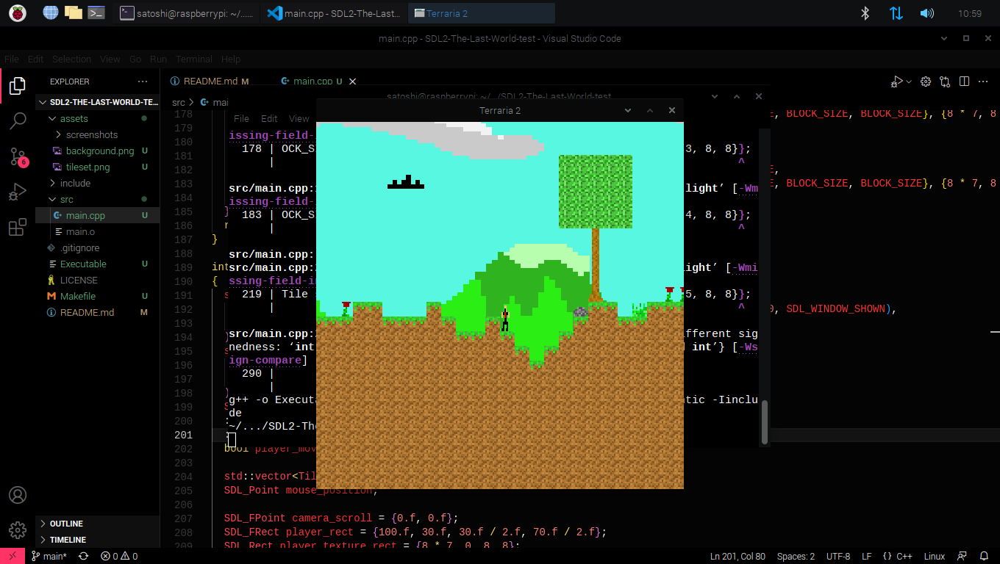
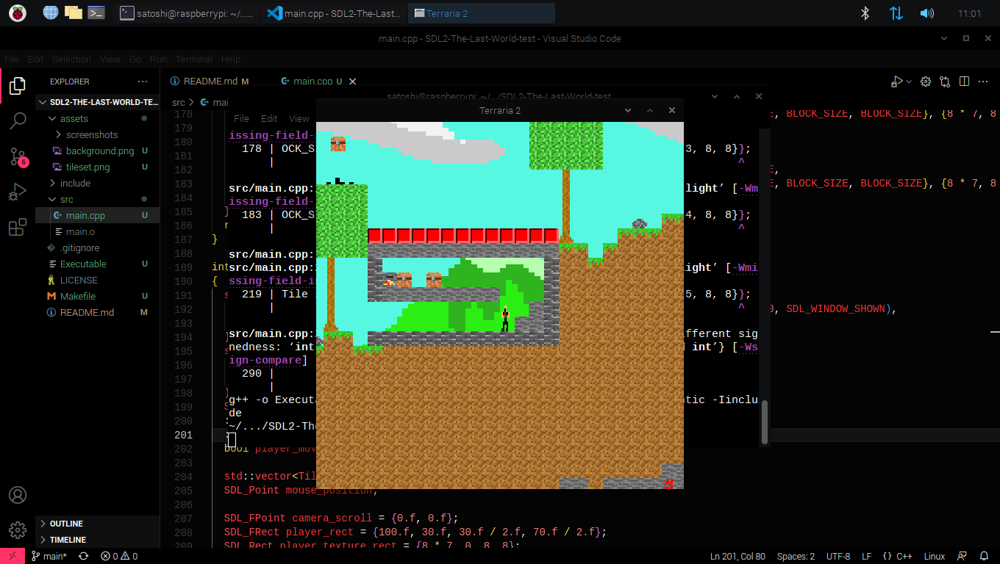
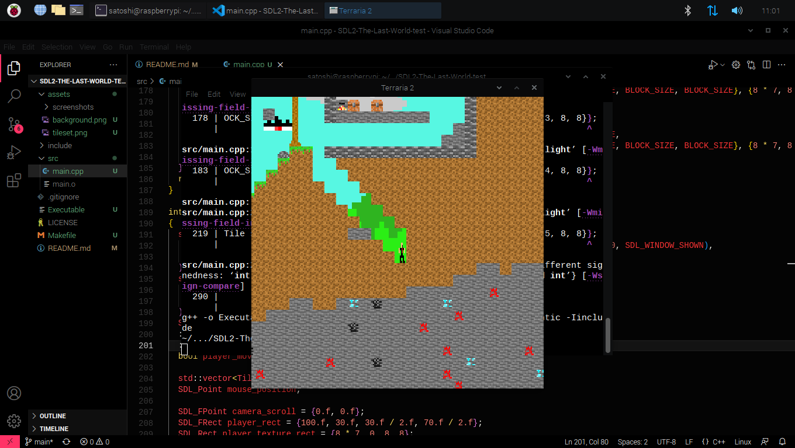
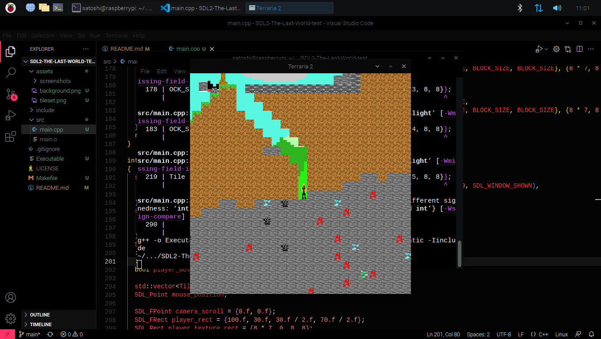

# SDL2-The-Last-World-test
This code is not good for read ;-; i will fix it

# Requirements
- SDL2
- SDL2_image

## Features
- Random World
- Block Selection (1..7)
- Eye (Don't look at it)
- Good tile collision (not perfect)
- (new) shadow
- (new) wall and collision update

## Screenshots

